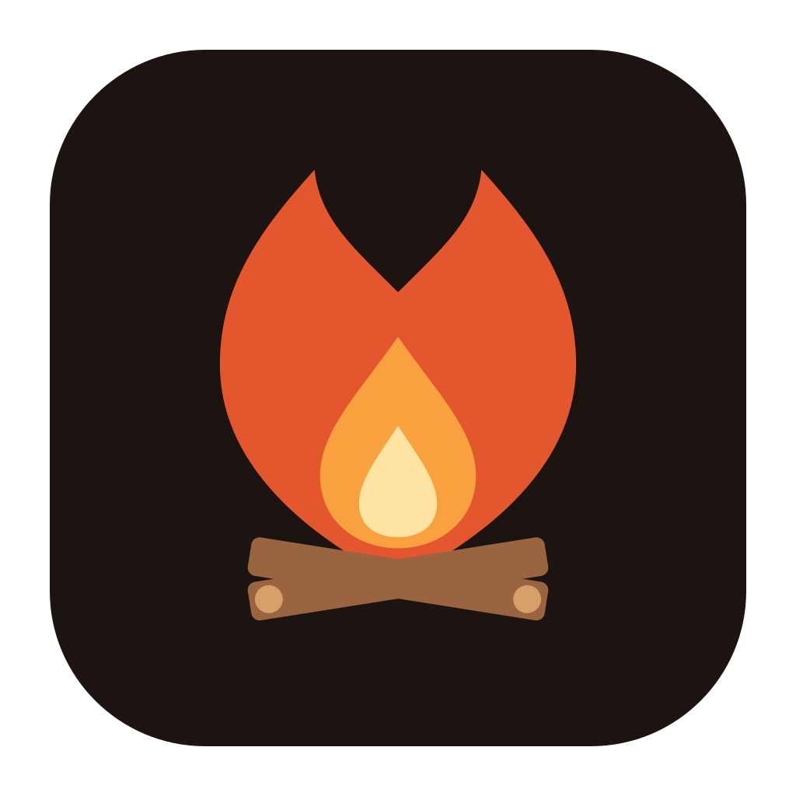

    

<h1 align="center">Hearth</h1>

A custom Discord desktop app with Vencord preinstalled, developed in the open.

[Hearth](https://github.com/hearthdesktop/hearth) is a community-driven fork of [Vesktop](https://github.com/Vencord/Vesktop).
It keeps what makes Vesktop good (lighter than the official app, better privacy, Linux screenshare with audio) and
builds its own features and fixes on top.

- **Install:** see the [Hearth README](https://github.com/hearthdesktop/hearth#installing)
- **Report a bug or ask for a feature:** [open an issue](https://github.com/hearthdesktop/hearth/issues/new/choose)
- **Contribute:** pull requests are welcome, AI-assisted ones included, as long as you review and test the code
  yourself; see [CONTRIBUTING.md](https://github.com/hearthdesktop/hearth/blob/main/CONTRIBUTING.md)

Hearth is licensed under the GPL-3.0-or-later, and exists thanks to Vesktop, Vencord and their contributors.
